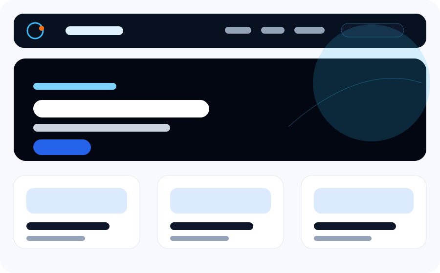
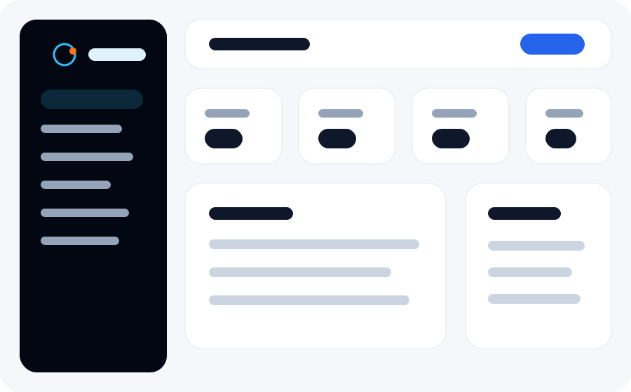

## Production Upgrade Commands

```bash
npm install
cp .env.example .env   # edit .env locally — never commit it
npm run db:sync
npm run migrate
npm run seed
npm run dev
npm test
```

Production:

```bash
npm ci --omit=dev
npm run migrate
pm2 start ecosystem.config.js
```

### Verification

Run before release or deployment:

```bash
npm install
npm run lint
npm run test:ci
npm run audit
npm run validate
npm run check
npm run predeploy
```

### Repository hygiene

`.env` is listed in `.gitignore` and must not be committed — use `.env.example` as the template. Generated files such as logs, coverage reports, uploads, database backups, test output files (`full-suite-run*.txt`, `test-output-full.txt`, `ci-artifact.zip`), and local demo folders (`photos/`) are excluded from Git.

Health endpoints:

- `GET /health`
- `GET /ready`
- `GET /version`

Testing uses a dedicated MySQL database configured with `TEST_DB_*` environment variables. CI runs migrations, seed data, and `npm run test:ci` with global coverage thresholds (lines ≥ 73%, statements ≥ 70%, functions ≥ 75%, branches ≥ 55%) across **321** integration tests. See [COMMERCIAL_READINESS.md](docs/COMMERCIAL_READINESS.md), [INSTALLATION.md](docs/INSTALLATION.md), and [TESTING.md](docs/TESTING.md).

<p align="center">
  
</p>

<h1 align="center">NodePress CMS</h1>

<p align="center">
  A WordPress-inspired publishing platform built with Node.js, Express, MySQL, Sequelize, EJS, Bootstrap 5, and a modern space-agency inspired interface.
</p>

<p align="center">
  <a href="#quick-start">Quick Start</a>
  ·
  <a href="#highlights">Features</a>
  ·
  <a href="#project-structure">Structure</a>
  ·
  <a href="#deployment">Deployment</a>
</p>

<p align="center">
  <a href="https://github.com/Coder-MoeTain/node_cms/actions/workflows/ci.yml"></a>
  <a href="https://github.com/Coder-MoeTain/node_cms/actions/workflows/security.yml"></a>
  <a href="https://codecov.io/gh/Coder-MoeTain/node_cms"></a>
  
  
  
  
  
  
  
  
  
</p>

---

NodePress CMS is a complete blog and content management system with a public website, admin dashboard, media library, theme settings, role permissions, SEO helpers, security tools, comments, dynamic menus, a government portal theme, live portal statistics, and a built-in server-side translation engine for English, Myanmar, Chinese, and Russian.

For the repository audit, missing-feature analysis, security review, and exact file-by-file upgrade notes, see [`docs/UPGRADE_ANALYSIS.md`](docs/UPGRADE_ANALYSIS.md). For the step-by-step implementation report and testing checklist, see [`docs/IMPLEMENTATION_REPORT.md`](docs/IMPLEMENTATION_REPORT.md).

## Preview

```text
Public Site  -> http://localhost:3000
Admin Panel  -> http://localhost:3000/admin/login
```

When the **admin login honeypot** is enabled, `/admin/login` is a decoy only — use the secret URL shown under **Admin → Security** (see [Login & Sessions and honeypot](#login--sessions-and-admin-login-honeypot)).

<p align="center">
  
  
</p>

<p align="center">
  <em>Screenshot gallery and recording steps: <a href="docs/DEMO.md">docs/DEMO.md</a></em>
</p>

### Demo video

<p align="center">
  
</p>

<p align="center">
  <em>Workflow diagram maps each feature to its dedicated test file. Screen recording steps: <a href="docs/DEMO.md">docs/DEMO.md</a></em>
</p>

<p align="center">
  <em>Screenshots above. Full workflow checklist: <a href="docs/DEMO.md">docs/DEMO.md</a> · Dedicated tests: <a href="docs/TESTING.md">docs/TESTING.md</a></em>
</p>

## Highlights

| Area | What You Get |
| --- | --- |
| Public Website | Home, blog, post detail, category, tag, search, contact, sitemap, and robots.txt pages |
| Admin Panel | Dashboard, posts, pages, media, menus, banners, sliders, themes, users, roles, settings, and security tools |
| Publishing | Drafts, publishing, private posts, scheduled dates, SEO fields, featured images, video embeds, tags, categories |
| Design System | Space-agency inspired frontend, modern admin dashboard, dynamic logo, favicon, colors, layout, dark mode |
| Media Library | Upload images, videos, PDFs, docs, copy URLs, and reuse assets in posts and pages |
| Security | Sessions, bcrypt, Helmet, CSRF, rate limiting, upload validation, blocked IPs, login attempts, **Login & Sessions** audit page, **admin login honeypot**, session revoke, real client IP behind proxies, activity logs, optional WebGuard ML WAF |
| Internationalization | Server-side translation engine (en, my, zh-CN, ru) with glossary files and database cache — no Google Translate |
| Portal Statistics | Live homepage stat counters (users, visitors, discussions, polls, blogs, events, mobile apps) from database activity |

## Maturity Level

**Overall: 9.0 / 10** — production-ready WordPress-like CMS with scheduled publishing, trash restore, SMTP mailer, expanded REST API v1, revision compare, and 310+ automated tests.

| Stage | Level | Meaning |
| --- | --- | --- |
| Original/Basic CMS | `3/10 - 5/10` | Basic content app with limited CMS depth |
| Current (this release) | **`9.0/10`** | Full publishing lifecycle, plugins/themes, RBAC, WAF, CPT/fields, import/export, mailer, scheduled cron |
| Professional WordPress-like CMS | `10/10` | Requires multisite content isolation, WXR import, Gutenberg-depth blocks, and 100% green CI on all hosts |

### Score by area

| Area | Score | Highlights |
| --- | --- | --- |
| Public UI/UX | **9.0** | Portal + blog themes, accessibility, pagination, contact |
| Admin UI/UX | **9.0** | Trash restore, revision compare, customizer, typed settings |
| Core CMS | **9.5** | Scheduled publish cron, trash/restore, CPT, fields, revisions |
| Themes | **9.0** | Child-theme uninstall guard (DB + disk), upload, customizer |
| Plugins | **9.0** | Full HTTP lifecycle, hooks, migrations |
| RBAC & security | **9.0** | 2FA, WAF, honeypot login trap, login/session audit, ownership policies, mailer abstraction |
| REST API | **8.5** | v1 read/write posts & pages, comments list, widgets |
| Tests & CI | **9.0** | 310+ tests, coverage thresholds, GitHub Actions |
| Ops & deploy | **8.5** | `publish:scheduled` CLI, Docker, health checks with WAF/SMTP |
| Docs & polish | **9.0** | Gap analysis, API docs, production checklist |

### Still needed for 10/10

- Multisite content isolation (`site_id` on all content tables)
- WXR import/export
- Full Gutenberg block library (current: lightweight block foundation)
- Media CDN / regenerate-thumbnails admin tool
- 100% stable CI on Windows + Linux (eliminate remaining flaky integration tests)

See [`docs/WORDPRESS_GAP_ANALYSIS.md`](docs/WORDPRESS_GAP_ANALYSIS.md) for the full gap table.

## Visual Experience

NodePress ships with a polished public theme and a matching admin interface.

<p align="center">
  
</p>

The public website uses dynamic menus, hero sliders, banners, blog cards, sidebar widgets, footer menus, logo settings, language switcher, and live portal statistics on the government portal theme.

<p align="center">
  
</p>

The admin area includes dashboard stats, content management, media uploads, user roles, theme controls, security settings, and site configuration.

Recent UI update: the Admin Console dashboard typography was reduced by `3pt` for the dashboard topbar and dashboard content. The change is scoped with `admin-dashboard-page` and `admin-dashboard` classes in `views/admin/dashboard.ejs`, with the matching font-size rules in `public/css/admin.css`.

## Tech Stack

| Layer | Technology |
| --- | --- |
| Backend | Node.js, Express.js |
| Database | MySQL |
| ORM | Sequelize |
| Views | EJS |
| UI | Bootstrap 5, custom CSS |
| Auth | Express Session, bcrypt |
| Uploads | Multer |
| Validation | Express Validator |
| Security | Helmet, CORS, CSRF, rate limiting |
| Editor | Self-hosted TinyMCE |

## Quick Start

### 1. Clone and install

```bash
git clone https://github.com/your-username/nodepress-cms.git
cd nodepress-cms
npm install
```

### 2. Configure environment

Copy the example file and edit values locally (`.env` is gitignored — never commit it):

```bash
cp .env.example .env
```

Key variables to review: `DB_*`, `SESSION_SECRET`, `APP_URL`, `TRUST_PROXY` (set `true` behind a reverse proxy), and optional `TEST_DB_*` for the test suite. See `.env.example` for the full list.

### 3. Create database

```sql
CREATE DATABASE nodepress_cms CHARACTER SET utf8mb4 COLLATE utf8mb4_unicode_ci;
```

### 4. Sync, migrate, and seed

```bash
npm run db:sync
npm run migrate
npm run seed
```

`npm run migrate` creates the database if needed, applies `database/schema.sql` on a **fresh empty database**, then runs incremental SQL migrations (WAF, translation cache, and other upgrades). Use it on new installs and after pulling updates.

### 5. Run

```bash
npm run dev
```

Open `http://localhost:3000`.

## Default Admin

```text
Email:    admin@example.com
Password: Admin@12345
Role:     Super Admin
```

The seeded admin account requires a password change after first login.

Test author account (after `npm run seed`):

```text
Email:    author@example.com
Password: Author@12345
Role:     Author (own posts & uploads only)
```

## Platform Maturity (10/10)

| Area | Highlights |
| --- | --- |
| UI/UX | WordPress-style admin tables, bulk trash, theme customizer, plugin dashboard widgets |
| Plugins | Hook system (`publicHead`, `publicFooter`, `dashboardWidgets`, `beforeMediaUpload`) |
| Themes | Template/partial resolution, custom CSS/JS, header/footer layout classes |
| WAF | Monitor/block modes, signature rules, IP lists, CSV export, optional WebGuard ML detection, automated tests |
| RBAC | Post/media ownership, publish_posts gate, dedicated resource permissions |
| API | Optional `API_KEY` protection via `X-API-Key` header |
| Ops | PM2 ecosystem, health endpoints, Docker Compose, deployment docs |

Optional API key in `.env`:

```env
API_KEY=your-long-random-api-key
```

Optional WebGuard ML WAF integration (requires a running WebGuard-ML API in the parent `webguard` project with trained models):

```env
WEBGUARD_API_URL=http://127.0.0.1:8001
WEBGUARD_API_KEY=your-webguard-service-api-key
WEBGUARD_ALLOW_LOCALHOST=true
WEBGUARD_TIMEOUT_MS=500
WEBGUARD_FAIL_OPEN=true
```

Set `SERVICE_API_KEY` in the WebGuard `.env` to the same value as `WEBGUARD_API_KEY`. Enable ML detection under **Admin → WAF → Settings**.

## Scripts

| Command | Description |
| --- | --- |
| `npm start` | Run the app with Node |
| `npm run dev` | Run the app with Nodemon |
| `npm run db:sync` | Sync Sequelize models to MySQL |
| `npm run migrate` | Run pending SQL migrations |
| `npm run seed` | Seed roles, permissions, settings, menus, themes, and default admin |
| `npm test` | Run Jest test suite |
| `npm run test:ci` | Run tests with coverage thresholds enforced (used in CI) |
| `npm run test:coverage` | Run tests and write `coverage/` report |
| `npm run lint` | Run ESLint |
| `npm run backup` | Create database and uploads backup |
| `npm run health` | Check application health |

## Documentation

| Guide | Description |
| --- | --- |
| [docs/ARCHITECTURE.md](docs/ARCHITECTURE.md) | System design, request flow, plugins, themes, WAF |
| [docs/API.md](docs/API.md) | REST API endpoints and authentication |
| [docs/PLUGIN_DEVELOPMENT.md](docs/PLUGIN_DEVELOPMENT.md) | Plugin hooks, lifecycle, migrations, packaging |
| [docs/THEME_DEVELOPMENT.md](docs/THEME_DEVELOPMENT.md) | Theme structure, customizer, child themes |
| [docs/TESTING.md](docs/TESTING.md) | Jest suite, coverage, CI database bootstrap |
| [docs/SECURITY.md](docs/SECURITY.md) | RBAC, WAF, 2FA, login lockout, IP blocking |
| [docs/DEPLOYMENT.md](docs/DEPLOYMENT.md) | Production deployment (Nginx, PM2, Docker) |
| [docs/PRODUCTION_CHECKLIST.md](docs/PRODUCTION_CHECKLIST.md) | Pre-launch security and ops checklist |
| [docs/BACKUP_AND_RESTORE.md](docs/BACKUP_AND_RESTORE.md) | Database backup and restore procedures |
| [docs/TROUBLESHOOTING.md](docs/TROUBLESHOOTING.md) | Common errors and fixes |

## Web Application Firewall

NodePress CMS includes an Express middleware WAF for public, admin, and API requests. Static assets are served before the WAF, while dynamic requests are inspected after body parsing, sessions, CSRF, and site context are available.

The WAF stores rules, logs, IP lists, settings, and dynamic rate-limit counters in MySQL through Sequelize: `waf_rules`, `waf_logs`, `waf_ip_lists`, `waf_settings`, and `waf_rate_limits`.

Admin users with `manage_waf` or `manage_security` can manage it from `/admin/waf`, `/admin/waf/settings`, `/admin/waf/rules`, `/admin/waf/logs`, and `/admin/waf/ip-lists`.

Default mode is `monitor`, so suspicious requests are logged before enforcement is enabled. Switch to `block` mode after reviewing logs and tuning false positives.

### WebGuard ML detection

NodePress can augment signature-based WAF scoring with trained models from the sibling **WebGuard-ML** project (`../webguard`). On each dynamic request, the WAF sends HTTP context to WebGuard’s `/api/ids/analyze` endpoint. Confident attack predictions (SQLi, XSS, CSRF) add an ML match to the risk score and appear in WAF logs as `WebGuard ML: <prediction>`.

**How it works**

1. Signature rules run first (existing behavior).
2. If ML detection is enabled, NodePress calls WebGuard with method, URL, query, body, and selected headers.
3. Predictions above the confidence threshold increase the risk score; high scores trigger log or block actions according to WAF mode.
4. If WebGuard is unreachable and `WEBGUARD_FAIL_OPEN=true` (default), requests continue without ML scoring.

**Setup**

1. **WebGuard** — train or copy a model into `webguard/models/` (`rf_*.joblib` + preprocessor). In `webguard/.env`:

   ```env
   SERVICE_API_KEY=your-long-random-service-key
   ```

   Start the WebGuard API (default dev port is often `8001`).

2. **NodePress** — in `.env`:

   ```env
   WEBGUARD_API_URL=http://127.0.0.1:8001
   WEBGUARD_API_KEY=your-long-random-service-key
   WEBGUARD_ALLOW_LOCALHOST=true
   WEBGUARD_TIMEOUT_MS=500
   WEBGUARD_FAIL_OPEN=true
   ```

3. Run `npm run migrate` (applies `018_waf_ml_integration.sql` for ML settings).

4. **Admin → WAF → Settings** — confirm the WebGuard health banner, enable **ML detection**, set confidence threshold (default `0.7`), optionally set a **Model ID** (blank = latest model). Keep **monitor** mode for 24–48 hours before blocking.

**Admin settings**

| Setting | Description |
| --- | --- |
| Enable ML detection | Turn WebGuard scoring on/off |
| Confidence threshold | Minimum model confidence (`0.1`–`1.0`) before acting |
| Model ID | Specific WebGuard model stem; empty uses the latest `rf_*.joblib` |
| ML detections can block alone | ML hits use `block` action, not only `log` |
| Ignore uncertain predictions | Skip results where WebGuard marks `uncertain: true` |

**Implementation files**

| File | Role |
| --- | --- |
| `utils/webguardClient.js` | HTTP client, health check, SSRF-safe outbound calls |
| `utils/wafMlHelper.js` | Request payload builder, label → category mapping |
| `middleware/waf.js` | ML scoring integrated into risk calculation |
| `database/migrations/018_waf_ml_integration.sql` | `ml_waf_*` settings in `waf_settings` |

Tests: `tests/wafMl.test.js`, `tests/webguardClient.test.js`.

### WAF Database Setup

For a fresh Sequelize setup:

```bash
npm run db:sync
npm run seed
```

For SQL-managed installs:

```bash
mysql -u root -p nodepress_cms < database/migrations/006_waf_system.sql
mysql -u root -p nodepress_cms < database/seed_waf_rules.sql
```

### WAF Testing Checklist

1. Normal homepage loads.
2. Normal admin login works.
3. Normal post creation works.
4. Rich text post content does not get falsely blocked.
5. SQL injection-like query is blocked in block mode.
6. SQL injection-like query is logged in monitor mode.
7. XSS-like payload is blocked in block mode.
8. Bad bot user-agent is blocked.
9. Blacklisted IP is blocked.
10. Whitelisted IP bypasses block.
11. WAF logs are created.
12. WAF log detail page escapes malicious content.
13. Admin can enable/disable WAF.
14. Admin can switch monitor/block mode.
15. Admin can create custom rule.
16. Invalid custom regex does not crash the app.
17. Auto-block creates a temporary block after repeated high-risk events.
18. WebGuard ML (when configured) logs or blocks high-confidence predictions in monitor/block mode.
19. WAF logs include `ml_prediction` metadata when ML detection fires.
20. Static assets still load.
21. File uploads still work.
22. Dangerous upload names are blocked.

## Project Structure

```text
nodepress-cms/
├── config/              App and database config
├── controllers/         Admin and public controllers
├── data/glossaries/     Translation glossary files (en-my, en-zh, en-ru)
├── database/            schema.sql, migrations, sync and seed scripts
├── middleware/          Auth, locale, portal visit tracking, security, WAF
├── models/              Sequelize models and associations
├── public/              CSS, JS, uploads
├── routes/              Admin, public, and API routes
├── utils/               Slug, SEO, translation engine, portal stats helpers
├── views/               EJS admin/public/theme/error views
├── .env                 Environment variables
├── package.json
└── server.js
```

## Core Features

### Public Website

- Responsive space-agency inspired design
- Dynamic header and footer menus
- Homepage banner and slider
- Blog list and single post pages
- Category and tag archive pages
- Search page
- About, contact, privacy, terms, and custom pages
- Sidebar widgets for recent posts, popular posts, and categories
- SEO-friendly URLs, sitemap, robots.txt, canonical URLs, and schema output
- Government portal homepage with quick services, tenders/jobs, media gallery, and statistics
- Language switcher with server-rendered translations (no third-party translation widgets)

### Translation (i18n)

NodePress uses an **internal translation engine** instead of Google Translate:

- **Languages:** English (default), Myanmar (`my`), Chinese (`zh-CN`), Russian (`ru`)
- **Cookie:** `np_lang` stores the visitor's language choice
- **Engine:** `utils/translationEngine.js` — glossary-based phrase and word matching with HTML-aware translation
- **Glossaries:** `data/glossaries/en-my.json`, `en-zh.json`, `en-ru.json` (extend these to add terms)
- **Cache:** `translation_cache` table stores translated strings for performance
- **Scope:** Menus, posts, pages, categories, banners, sliders, and site settings are translated on the server before render
- **Manual content translations:** On each post, page, or custom post type item, use the **Translations** panel in the admin editor to enter human-written Myanmar, Chinese, or Russian versions (title, excerpt, body, SEO). These are stored in `content_translations` and take priority over glossary auto-translation.
- **Content language:** Posts default to Myanmar (`my`) as the source language. Set `default_content_locale` in **Site Settings** (or `DEFAULT_CONTENT_LOCALE` in `.env`) to `en` if your posts are written in English. UI labels still translate from English glossaries.
- **Fallback:** If no manual translation exists for a field, the glossary engine still applies phrase/word matching automatically (English source content only).

To add UI labels and common phrases, edit the JSON glossary files under `data/glossaries/`. For full post bodies, use the admin **Translations** panel. Run `npm run migrate` to apply translation-related database migrations on existing installs.

### Portal Statistics

The government portal theme shows **live statistics** on the homepage (Government Directory & Statistics section). Each stat is a clickable link:

| Stat | Data source |
| --- | --- |
| Registered users | Active users in the database |
| Visitors | Post view totals + daily unique portal sessions |
| Discussions | Approved comments |
| Polls & Survey | Contact messages and posts matching poll/survey keywords |
| Blogs | Published post count |
| Upcoming Events | Published or scheduled posts with a future date |
| Mobile App Gallery | App store links, app-related pages, and mobile media files |

Visitor sessions are tracked once per day per session via `middleware/portalVisit.js` and stored in the `portal_visit_count` site setting.

### Admin Panel

- Dashboard cards and recent activity
- CRUD screens with search, filters, pagination, badges, and delete confirmations
- TinyMCE rich text editor
- Media upload library with URL copy
- Theme and layout customization
- Site settings for logo, favicon, social links, contact details, and maintenance mode
- **Login & Sessions** page under Settings (active sessions, login success/failure log, revoke session)
- Security plugin-style settings page with **admin login honeypot** controls

### Content Management

- Posts with title, slug, content, excerpt, status, category, tags, author, featured image, video URL, SEO title, SEO description, views, and publish date
- Pages with custom slug and SEO fields
- Nested categories and tags
- Comments with moderation
- Contact messages with read/unread status

### Users and Permissions

Default roles:

- Super Admin
- Admin
- Editor
- Author
- Subscriber

Example permissions:

- `manage_posts`
- `create_posts`
- `edit_posts`
- `delete_posts`
- `publish_posts`
- `manage_pages`
- `manage_media`
- `manage_users`
- `manage_roles`
- `manage_themes`
- `manage_settings`
- `manage_security`

## Main Routes

### Public

| Method | Route |
| --- | --- |
| `GET` | `/` |
| `GET` | `/blog` |
| `GET` | `/post/:slug` |
| `GET` | `/category/:slug` |
| `GET` | `/tag/:slug` |
| `GET` | `/page/:slug` |
| `GET` | `/search` |
| `GET` | `/contact` |
| `POST` | `/contact` |
| `POST` | `/post/:id/comment` |
| `GET` | `/sitemap.xml` |
| `GET` | `/robots.txt` |

### Admin

| Method | Route |
| --- | --- |
| `GET` | `/admin` |
| `GET/POST` | `/admin/login` |
| `POST` | `/admin/logout` |
| `GET/PUT` | `/admin/profile` |
| `GET/POST/PUT/DELETE` | `/admin/posts` |
| `GET/POST/PUT/DELETE` | `/admin/pages` |
| `GET/POST/PUT/DELETE` | `/admin/categories` |
| `GET/POST/PUT/DELETE` | `/admin/tags` |
| `GET/POST/DELETE` | `/admin/media` |
| `GET/POST/PUT/DELETE` | `/admin/users` |
| `GET/POST/PUT/DELETE` | `/admin/roles` |
| `GET/POST/PUT/DELETE` | `/admin/menus` |
| `GET/POST/PUT/DELETE` | `/admin/banners` |
| `GET/POST/PUT/DELETE` | `/admin/sliders` |
| `GET/PUT` | `/admin/settings` |
| `GET` | `/admin/settings/login-sessions` |
| `POST` | `/admin/settings/login-sessions/revoke` |
| `GET/POST/PUT` | `/admin/themes` |
| `GET/PUT/POST/DELETE` | `/admin/security` |
| `POST` | `/admin/security/regenerate-login-path` |
| `GET/POST` | `/admin/np-auth-*` (secret login path when honeypot enabled) |

## Database

Schema and seed files are included:

```text
database/schema.sql
database/seed.sql
database/migrations/
database/sync.js
database/seed.js
database/migrate.js
```

Run migrations after upgrades (or on a fresh server):

```bash
npm run migrate
npm run seed
```

On a new database, `npm run migrate` loads `database/schema.sql` automatically before incremental migrations. Manual import is only needed if you prefer it:

```bash
mysql -u root -p < database/schema.sql
mysql -u root -p < database/seed.sql
```

Use `npm run seed` afterward to generate the bcrypt-hashed default admin account.

## Security

- Passwords are hashed with bcrypt.
- Admin routes are protected by session authentication.
- Sensitive admin pages use permission middleware.
- Helmet, CORS, rate limiting, CSRF, and secure cookie options are configured.
- File uploads validate type, size, and blocked executable extensions.
- Rich post/page HTML is sanitized before saving.
- Sequelize protects database queries from SQL injection.
- Login attempts, blocked IPs, and admin activity are logged.
- Optional WebGuard ML scoring augments the WAF when `WEBGUARD_API_URL` and credentials are configured.

### Login & Sessions and admin login honeypot

Recent security additions for admin authentication monitoring and deception:

#### Login & Sessions (`/admin/settings/login-sessions`)

Available under **Settings → Login & Sessions** (requires `manage_settings` or `manage_security`).

| Feature | Description |
| --- | --- |
| Active admin sessions | Username, email, client IP, logged-in time, last activity, expiry, session ID |
| Revoke session | Per-session **Revoke** button; revoking your own session logs you out immediately |
| Login activity | Paginated success/failure log with email and IP filters |
| Client IP | Uses `X-Forwarded-For`, `X-Real-IP`, `CF-Connecting-IP`, etc. when behind a reverse proxy (see below) |

Key files: `utils/loginSessionHelper.js`, `controllers/admin/loginSessionsController.js`, `views/admin/settings/login-sessions.ejs`.

Tests: `tests/loginSessions.test.js`.

#### Admin login honeypot

Configure under **Admin → Security → Admin Login Honeypot**.

| Setting | Behavior |
| --- | --- |
| Honeypot enabled | `/admin/login` shows a normal-looking login form but never authenticates |
| Secret login URL | Real admin login moves to `/admin/np-auth-<random>` (configurable slug) |
| Auto-block | Any honeypot login attempt immediately blocks the client IP in **Blocked IPs** and **WAF blacklist**, logs `honeypot_trap`, and shows a generic invalid-credentials message |
| Public site | The portal **Login** link is hidden while honeypot mode is on so the secret URL is not exposed |

Actions:

- **Save Honeypot Settings** — enable/disable and set the secret path slug
- **Generate New Secret URL** — rotate the secret login path

Key files: `utils/adminLoginPath.js`, `controllers/admin/authController.js` (`honeypotLogin`, `honeypotLoginForm`).

Tests: `tests/adminLoginHoneypot.test.js`.

#### Real client IP behind nginx / Cloudflare

Login & Sessions, honeypot blocks, and WAF logs resolve the visitor IP from proxy headers when:

1. `TRUST_PROXY=true` in `.env`, **or**
2. WAF **Trust proxy headers** is enabled, **or**
3. The TCP connection comes from localhost/private network (typical nginx → Node) **and** forwarding headers are present

Every request sets `req.clientIp` via `middleware/clientIp.js`. Session IPs are backfilled on the next admin request if a loopback address was stored earlier.

Production nginx example:

```nginx
proxy_set_header X-Real-IP $remote_addr;
proxy_set_header X-Forwarded-For $proxy_add_x_forwarded_for;
```

Set in `.env`:

```env
TRUST_PROXY=true
```

Production recommendations:

- Set a strong `SESSION_SECRET`.
- Use HTTPS.
- Set `NODE_ENV=production`.
- Set `TRUST_PROXY=true` when behind Nginx, Cloudflare, or a load balancer; enable WAF **Trust proxy headers** if needed.
- Consider enabling the **admin login honeypot** and bookmarking only the secret login URL.
- Keep MySQL private.
- Put uploads behind safe server rules.
- Configure regular database backups.

## Web Application Firewall (WAF)

NodePress includes a defensive WAF integrated with the admin security panel. Signature rules, IP lists, and rate limits are built in; optional **WebGuard ML** detection layers trained-model scoring on top when WebGuard is configured (see [WebGuard ML detection](#webguard-ml-detection)).

### Quick start

```bash
npm run migrate
npm run seed
npm run dev
```

Open **Admin → Security → WAF Dashboard** at `/admin/waf`.

### Modes

- **Monitor** — log suspicious traffic without blocking (recommended first)
- **Block** — block requests that exceed the risk threshold
- **Disabled** — turn off WAF inspection

### Admin pages

| Page | URL |
|------|-----|
| WAF Dashboard | `/admin/waf` |
| WAF Settings | `/admin/waf/settings` |
| WAF Rules | `/admin/waf/rules` |
| WAF Logs | `/admin/waf/logs` |
| WAF IP Lists | `/admin/waf/ip-lists` |

Requires `manage_waf` or `manage_security` permission.

### Verify WAF

1. Set mode to **monitor** in WAF Settings.
2. Visit `/?q=1%20UNION%20SELECT%201` — check `/admin/waf/logs` for a logged event.
3. Switch to **block** mode and repeat — request should return 403.
4. Confirm normal posts, pages, and media uploads still work.

### Verify WebGuard ML (optional)

1. Configure `WEBGUARD_API_URL` and `WEBGUARD_API_KEY` in `.env` (see [WebGuard ML detection](#webguard-ml-detection) above).
2. Enable **ML detection** in WAF Settings; keep mode on **monitor**.
3. Send a suspicious request (e.g. `/?id=1' OR '1'='1`) and confirm a **WebGuard ML:** entry in `/admin/waf/logs`.
4. Review false positives before enabling **block** mode or lowering the confidence threshold.

Full documentation: [docs/SECURITY.md](docs/SECURITY.md)

## Deployment

### Ubuntu + Nginx + PM2

```bash
sudo apt update
sudo apt install -y nginx mysql-server
curl -fsSL https://deb.nodesource.com/setup_lts.x | sudo -E bash -
sudo apt install -y nodejs
sudo npm install -g pm2
```

Install and run:

```bash
cd /var/www/nodepress-cms
npm ci --omit=dev
npm run db:sync
npm run seed
pm2 start server.js --name nodepress-cms
pm2 save
pm2 startup
```

Nginx config:

```nginx
server {
  listen 80;
  server_name example.com www.example.com;

  location / {
    proxy_pass http://127.0.0.1:3000;
    proxy_http_version 1.1;
    proxy_set_header Host $host;
    proxy_set_header X-Real-IP $remote_addr;
    proxy_set_header X-Forwarded-For $proxy_add_x_forwarded_for;
    proxy_set_header X-Forwarded-Proto $scheme;
  }
}
```

Enable site:

```bash
sudo ln -s /etc/nginx/sites-available/nodepress-cms /etc/nginx/sites-enabled/
sudo nginx -t
sudo systemctl reload nginx
```

Add HTTPS:

```bash
sudo apt install -y certbot python3-certbot-nginx
sudo certbot --nginx -d example.com -d www.example.com
```

## Troubleshooting

### TinyMCE says editors are read-only

This project uses self-hosted TinyMCE from `node_modules/tinymce`. Restart the server after installing dependencies:

```bash
npm install
npm run dev
```

### Database connection fails

Check `.env`:

```env
DB_HOST=127.0.0.1
DB_PORT=3306
DB_NAME=nodepress_cms
DB_USER=root
DB_PASSWORD=
```

Then verify MySQL is running and the database exists.

### Uploaded files do not appear

Check that `public/uploads` exists and the server process can write to it.

## Customization

- Public theme styles: `public/css/site.css`
- Admin theme styles: `public/css/admin.css`
- Public EJS templates: `views/public`
- Admin EJS templates: `views/admin`
- CRUD resources: `controllers/admin/crudController.js`
- Models and relations: `models/`
- Translation glossaries: `data/glossaries/`
- Translation engine: `utils/translationEngine.js`
- Portal stats: `utils/portalStats.js`
- Default seed data: `database/seed.js`

## License

MIT License. Use, modify, and deploy freely.