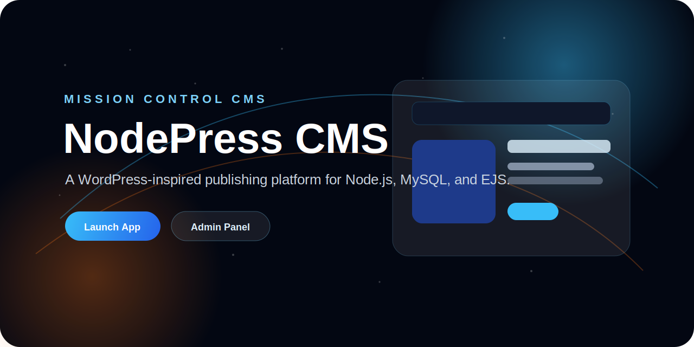
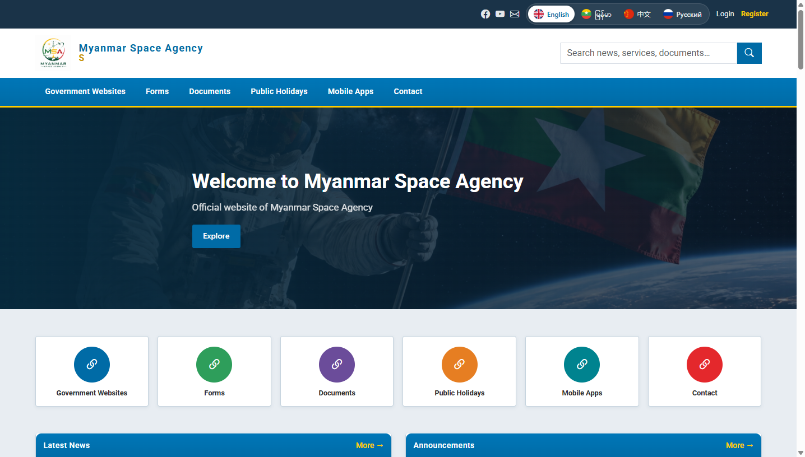
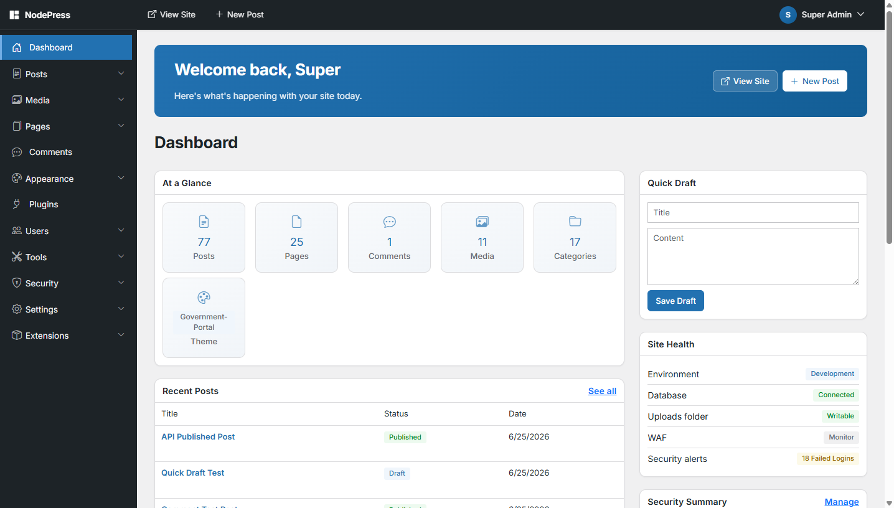

## Production Upgrade Commands

```bash
npm install
npm run db:sync
npm run migrate
npm run seed
npm run dev
npm test
```

Production:

```bash
npm ci --omit=dev
npm run migrate
pm2 start ecosystem.config.js
```

Health endpoints:

- `GET /health`
- `GET /ready`

Testing uses a dedicated MySQL database configured with `TEST_DB_*` environment variables. CI runs migrations, seed data, and `test:ci` with global coverage thresholds (lines ≥ 80%, statements ≥ 77%, functions ≥ 75%, branches ≥ 55%). See `.env.example`, `docs/DEPLOYMENT.md`, `docs/DEMO.md`, and `docs/BACKUP_AND_RESTORE.md`.

<p align="center">
  
</p>

<h1 align="center">NodePress CMS</h1>

<p align="center">
  A WordPress-inspired publishing platform built with Node.js, Express, MySQL, Sequelize, EJS, Bootstrap 5, and a modern space-agency inspired interface.
</p>

<p align="center">
  <a href="#quick-start">Quick Start</a>
  ·
  <a href="#highlights">Features</a>
  ·
  <a href="#project-structure">Structure</a>
  ·
  <a href="#deployment">Deployment</a>
</p>

<p align="center">
  <a href="https://github.com/Coder-MoeTain/node_cms/actions/workflows/ci.yml"></a>
  <a href="https://codecov.io/gh/Coder-MoeTain/node_cms"></a>
  
  
  
  
  
  
  
  
</p>

---

NodePress CMS is a complete blog and content management system with a public website, admin dashboard, media library, theme settings, role permissions, SEO helpers, security tools, comments, dynamic menus, a government portal theme, live portal statistics, and a built-in server-side translation engine for English, Myanmar, Chinese, and Russian.

For the repository audit, missing-feature analysis, security review, and exact file-by-file upgrade notes, see [`docs/UPGRADE_ANALYSIS.md`](docs/UPGRADE_ANALYSIS.md). For the step-by-step implementation report and testing checklist, see [`docs/IMPLEMENTATION_REPORT.md`](docs/IMPLEMENTATION_REPORT.md).

## Preview

```text
Public Site  -> http://localhost:3000
Admin Panel  -> http://localhost:3000/admin/login
```

<p align="center">
  
  
</p>

<p align="center">
  <em>Screenshot gallery and recording steps: <a href="docs/DEMO.md">docs/DEMO.md</a></em>
</p>

### Demo video

<p align="center">
  <a href="docs/DEMO.md"></a>
</p>

<p align="center">
  <em>Live screenshots above. For a walkthrough video, follow the recording steps in <a href="docs/DEMO.md">docs/DEMO.md</a>.</em>
</p>

## Highlights

| Area | What You Get |
| --- | --- |
| Public Website | Home, blog, post detail, category, tag, search, contact, sitemap, and robots.txt pages |
| Admin Panel | Dashboard, posts, pages, media, menus, banners, sliders, themes, users, roles, settings, and security tools |
| Publishing | Drafts, publishing, private posts, scheduled dates, SEO fields, featured images, video embeds, tags, categories |
| Design System | Space-agency inspired frontend, modern admin dashboard, dynamic logo, favicon, colors, layout, dark mode |
| Media Library | Upload images, videos, PDFs, docs, copy URLs, and reuse assets in posts and pages |
| Security | Sessions, bcrypt, Helmet, CSRF, rate limiting, upload validation, blocked IPs, login attempts, activity logs |
| Internationalization | Server-side translation engine (en, my, zh-CN, ru) with glossary files and database cache — no Google Translate |
| Portal Statistics | Live homepage stat counters (users, visitors, discussions, polls, blogs, events, mobile apps) from database activity |

## Maturity Level

**Overall: 9.2 / 10** — a production-ready, WordPress-like CMS foundation. Strong for self-hosted blogs, portals, and admin-managed sites; not yet full enterprise WordPress parity.

| Stage | Level | Meaning |
| --- | --- | --- |
| Original/Basic CMS | `3/10 - 5/10` | Basic content app with limited CMS depth |
| Current (this release) | **`9.2/10`** | Polished public + admin UI, plugin/theme lifecycle, RBAC, security tooling, i18n, 244 automated tests (~82% line coverage), and CI |
| Professional WordPress-like CMS | `10/10` | Requires production email flows, media pipeline/CDN, complete RBAC on every edge case, block/theme marketplace depth, and full ops hardening |

### Score by area

| Area | Score | Highlights |
| --- | --- | --- |
| Public UI/UX | **9.0** | Portal + standard blog themes, skip link, alt text, pagination, form validation with prefill, empty states |
| Admin UI/UX | **9.0** | Design system, dashboard widgets, dismissible toasts, typed settings, grouped RBAC, WAF aligned with admin |
| Core CMS | **9.0** | Posts, pages, media, menus, banners, sliders, SEO, scheduling, comments, contact |
| Themes | **8.5** | Upload, activate, child themes, customizer, government portal preset |
| Plugins | **8.5** | Install/activate/deactivate/uninstall, hooks, migrations, integration tests |
| RBAC & security | **8.5** | Roles, ownership policies, 2FA, WAF, brute-force protection, activity logs |
| Internationalization | **8.5** | Server-side translation (en, my, zh-CN, ru) with glossary + DB cache |
| Tests & CI | **9.0** | 244 tests, coverage thresholds enforced, GitHub Actions (lint, test, audit, docker) |
| Ops & deploy | **8.0** | Docker Compose, health/ready endpoints, SQL migrations, npm audit (high threshold) |
| Docs & polish | **8.5** | README badges, screenshots, demo guide, upgrade analysis |

### Still needed for 10/10

- Production email (password reset, notifications) and backup automation
- Media pipeline: thumbnails/optimization, optional CDN, private assets
- RBAC coverage on every admin/API route and UI surface
- Theme/plugin ecosystem depth (blocks, asset pipeline, marketplace-style isolation)
- Confirm CI green on GitHub after latest changes are pushed

See [`docs/UPGRADE_ANALYSIS.md`](docs/UPGRADE_ANALYSIS.md) for the full upgrade roadmap.

## Visual Experience

NodePress ships with a polished public theme and a matching admin interface.

<p align="center">
  
</p>

The public website uses dynamic menus, hero sliders, banners, blog cards, sidebar widgets, footer menus, logo settings, language switcher, and live portal statistics on the government portal theme.

<p align="center">
  
</p>

The admin area includes dashboard stats, content management, media uploads, user roles, theme controls, security settings, and site configuration.

Recent UI update: the Admin Console dashboard typography was reduced by `3pt` for the dashboard topbar and dashboard content. The change is scoped with `admin-dashboard-page` and `admin-dashboard` classes in `views/admin/dashboard.ejs`, with the matching font-size rules in `public/css/admin.css`.

## Tech Stack

| Layer | Technology |
| --- | --- |
| Backend | Node.js, Express.js |
| Database | MySQL |
| ORM | Sequelize |
| Views | EJS |
| UI | Bootstrap 5, custom CSS |
| Auth | Express Session, bcrypt |
| Uploads | Multer |
| Validation | Express Validator |
| Security | Helmet, CORS, CSRF, rate limiting |
| Editor | Self-hosted TinyMCE |

## Quick Start

### 1. Clone and install

```bash
git clone https://github.com/your-username/nodepress-cms.git
cd nodepress-cms
npm install
```

### 2. Configure environment

Create or update `.env`:

```env
NODE_ENV=development
APP_NAME="NodePress CMS"
APP_URL=http://localhost:3000
PORT=3000

DB_HOST=127.0.0.1
DB_PORT=3306
DB_NAME=nodepress_cms
DB_USER=root
DB_PASSWORD=

SESSION_SECRET=change-this-long-random-secret
SESSION_NAME=nodepress.sid
SESSION_MAX_AGE=86400000

UPLOAD_MAX_SIZE_MB=25
ADMIN_SESSION_TIMEOUT_MINUTES=60
```

### 3. Create database

```sql
CREATE DATABASE nodepress_cms CHARACTER SET utf8mb4 COLLATE utf8mb4_unicode_ci;
```

### 4. Sync, migrate, and seed

```bash
npm run db:sync
npm run migrate
npm run seed
```

`npm run migrate` applies incremental SQL migrations (WAF, translation cache, and other upgrades). Use it on existing databases after pulling updates.

### 5. Run

```bash
npm run dev
```

Open `http://localhost:3000`.

## Default Admin

```text
Email:    admin@example.com
Password: Admin@12345
Role:     Super Admin
```

The seeded admin account requires a password change after first login.

Test author account (after `npm run seed`):

```text
Email:    author@example.com
Password: Author@12345
Role:     Author (own posts & uploads only)
```

## Platform Maturity (10/10)

| Area | Highlights |
| --- | --- |
| UI/UX | WordPress-style admin tables, bulk trash, theme customizer, plugin dashboard widgets |
| Plugins | Hook system (`publicHead`, `publicFooter`, `dashboardWidgets`, `beforeMediaUpload`) |
| Themes | Template/partial resolution, custom CSS/JS, header/footer layout classes |
| WAF | Monitor/block modes, rules, IP lists, CSV export, automated tests |
| RBAC | Post/media ownership, publish_posts gate, dedicated resource permissions |
| API | Optional `API_KEY` protection via `X-API-Key` header |
| Ops | PM2 ecosystem, health endpoints, Docker Compose, deployment docs |

Optional API key in `.env`:

```env
API_KEY=your-long-random-api-key
```

## Scripts

| Command | Description |
| --- | --- |
| `npm start` | Run the app with Node |
| `npm run dev` | Run the app with Nodemon |
| `npm run db:sync` | Sync Sequelize models to MySQL |
| `npm run migrate` | Run pending SQL migrations |
| `npm run seed` | Seed roles, permissions, settings, menus, themes, and default admin |
| `npm test` | Run Jest test suite |
| `npm run test:ci` | Run tests with coverage thresholds enforced (used in CI) |
| `npm run test:coverage` | Run tests and write `coverage/` report |
| `npm run lint` | Run ESLint |
| `npm run backup` | Create database and uploads backup |
| `npm run health` | Check application health |

## Documentation

| Guide | Description |
| --- | --- |
| [docs/ARCHITECTURE.md](docs/ARCHITECTURE.md) | System design, request flow, plugins, themes, WAF |
| [docs/API.md](docs/API.md) | REST API endpoints and authentication |
| [docs/PLUGIN_DEVELOPMENT.md](docs/PLUGIN_DEVELOPMENT.md) | Plugin hooks, lifecycle, migrations, packaging |
| [docs/THEME_DEVELOPMENT.md](docs/THEME_DEVELOPMENT.md) | Theme structure, customizer, child themes |
| [docs/TESTING.md](docs/TESTING.md) | Jest suite, coverage, CI database bootstrap |
| [docs/SECURITY.md](docs/SECURITY.md) | RBAC, WAF, 2FA, login lockout, IP blocking |
| [docs/DEPLOYMENT.md](docs/DEPLOYMENT.md) | Production deployment (Nginx, PM2, Docker) |
| [docs/PRODUCTION_CHECKLIST.md](docs/PRODUCTION_CHECKLIST.md) | Pre-launch security and ops checklist |
| [docs/BACKUP_AND_RESTORE.md](docs/BACKUP_AND_RESTORE.md) | Database backup and restore procedures |
| [docs/TROUBLESHOOTING.md](docs/TROUBLESHOOTING.md) | Common errors and fixes |

## Web Application Firewall

NodePress CMS includes an Express middleware WAF for public, admin, and API requests. Static assets are served before the WAF, while dynamic requests are inspected after body parsing, sessions, CSRF, and site context are available.

The WAF stores rules, logs, IP lists, settings, and dynamic rate-limit counters in MySQL through Sequelize: `waf_rules`, `waf_logs`, `waf_ip_lists`, `waf_settings`, and `waf_rate_limits`.

Admin users with `manage_waf` or `manage_security` can manage it from `/admin/waf`, `/admin/waf/settings`, `/admin/waf/rules`, `/admin/waf/logs`, and `/admin/waf/ip-lists`.

Default mode is `monitor`, so suspicious requests are logged before enforcement is enabled. Switch to `block` mode after reviewing logs and tuning false positives.

### WAF Database Setup

For a fresh Sequelize setup:

```bash
npm run db:sync
npm run seed
```

For SQL-managed installs:

```bash
mysql -u root -p nodepress_cms < database/migrations/006_waf_system.sql
mysql -u root -p nodepress_cms < database/seed_waf_rules.sql
```

### WAF Testing Checklist

1. Normal homepage loads.
2. Normal admin login works.
3. Normal post creation works.
4. Rich text post content does not get falsely blocked.
5. SQL injection-like query is blocked in block mode.
6. SQL injection-like query is logged in monitor mode.
7. XSS-like payload is blocked in block mode.
8. Bad bot user-agent is blocked.
9. Blacklisted IP is blocked.
10. Whitelisted IP bypasses block.
11. WAF logs are created.
12. WAF log detail page escapes malicious content.
13. Admin can enable/disable WAF.
14. Admin can switch monitor/block mode.
15. Admin can create custom rule.
16. Invalid custom regex does not crash the app.
17. Auto-block creates a temporary block after repeated high-risk events.
18. Static assets still load.
19. File uploads still work.
20. Dangerous upload names are blocked.

## Project Structure

```text
nodepress-cms/
├── config/              App and database config
├── controllers/         Admin and public controllers
├── data/glossaries/     Translation glossary files (en-my, en-zh, en-ru)
├── database/            schema.sql, migrations, sync and seed scripts
├── middleware/          Auth, locale, portal visit tracking, security, WAF
├── models/              Sequelize models and associations
├── public/              CSS, JS, uploads
├── routes/              Admin, public, and API routes
├── utils/               Slug, SEO, translation engine, portal stats helpers
├── views/               EJS admin/public/theme/error views
├── .env                 Environment variables
├── package.json
└── server.js
```

## Core Features

### Public Website

- Responsive space-agency inspired design
- Dynamic header and footer menus
- Homepage banner and slider
- Blog list and single post pages
- Category and tag archive pages
- Search page
- About, contact, privacy, terms, and custom pages
- Sidebar widgets for recent posts, popular posts, and categories
- SEO-friendly URLs, sitemap, robots.txt, canonical URLs, and schema output
- Government portal homepage with quick services, tenders/jobs, media gallery, and statistics
- Language switcher with server-rendered translations (no third-party translation widgets)

### Translation (i18n)

NodePress uses an **internal translation engine** instead of Google Translate:

- **Languages:** English (default), Myanmar (`my`), Chinese (`zh-CN`), Russian (`ru`)
- **Cookie:** `np_lang` stores the visitor's language choice
- **Engine:** `utils/translationEngine.js` — glossary-based phrase and word matching with HTML-aware translation
- **Glossaries:** `data/glossaries/en-my.json`, `en-zh.json`, `en-ru.json` (extend these to add terms)
- **Cache:** `translation_cache` table stores translated strings for performance
- **Scope:** Menus, posts, pages, categories, banners, sliders, and site settings are translated on the server before render

To add or improve translations, edit the JSON glossary files under `data/glossaries/`. Run `npm run migrate` to create the translation cache table on existing installs.

### Portal Statistics

The government portal theme shows **live statistics** on the homepage (Government Directory & Statistics section). Each stat is a clickable link:

| Stat | Data source |
| --- | --- |
| Registered users | Active users in the database |
| Visitors | Post view totals + daily unique portal sessions |
| Discussions | Approved comments |
| Polls & Survey | Contact messages and posts matching poll/survey keywords |
| Blogs | Published post count |
| Upcoming Events | Published or scheduled posts with a future date |
| Mobile App Gallery | App store links, app-related pages, and mobile media files |

Visitor sessions are tracked once per day per session via `middleware/portalVisit.js` and stored in the `portal_visit_count` site setting.

### Admin Panel

- Dashboard cards and recent activity
- CRUD screens with search, filters, pagination, badges, and delete confirmations
- TinyMCE rich text editor
- Media upload library with URL copy
- Theme and layout customization
- Site settings for logo, favicon, social links, contact details, and maintenance mode
- Security plugin-style settings page

### Content Management

- Posts with title, slug, content, excerpt, status, category, tags, author, featured image, video URL, SEO title, SEO description, views, and publish date
- Pages with custom slug and SEO fields
- Nested categories and tags
- Comments with moderation
- Contact messages with read/unread status

### Users and Permissions

Default roles:

- Super Admin
- Admin
- Editor
- Author
- Subscriber

Example permissions:

- `manage_posts`
- `create_posts`
- `edit_posts`
- `delete_posts`
- `publish_posts`
- `manage_pages`
- `manage_media`
- `manage_users`
- `manage_roles`
- `manage_themes`
- `manage_settings`
- `manage_security`

## Main Routes

### Public

| Method | Route |
| --- | --- |
| `GET` | `/` |
| `GET` | `/blog` |
| `GET` | `/post/:slug` |
| `GET` | `/category/:slug` |
| `GET` | `/tag/:slug` |
| `GET` | `/page/:slug` |
| `GET` | `/search` |
| `GET` | `/contact` |
| `POST` | `/contact` |
| `POST` | `/post/:id/comment` |
| `GET` | `/sitemap.xml` |
| `GET` | `/robots.txt` |

### Admin

| Method | Route |
| --- | --- |
| `GET` | `/admin` |
| `GET/POST` | `/admin/login` |
| `POST` | `/admin/logout` |
| `GET/PUT` | `/admin/profile` |
| `GET/POST/PUT/DELETE` | `/admin/posts` |
| `GET/POST/PUT/DELETE` | `/admin/pages` |
| `GET/POST/PUT/DELETE` | `/admin/categories` |
| `GET/POST/PUT/DELETE` | `/admin/tags` |
| `GET/POST/DELETE` | `/admin/media` |
| `GET/POST/PUT/DELETE` | `/admin/users` |
| `GET/POST/PUT/DELETE` | `/admin/roles` |
| `GET/POST/PUT/DELETE` | `/admin/menus` |
| `GET/POST/PUT/DELETE` | `/admin/banners` |
| `GET/POST/PUT/DELETE` | `/admin/sliders` |
| `GET/PUT` | `/admin/settings` |
| `GET/POST/PUT` | `/admin/themes` |
| `GET/PUT/POST/DELETE` | `/admin/security` |

## Database

Schema and seed files are included:

```text
database/schema.sql
database/seed.sql
database/migrations/
database/sync.js
database/seed.js
database/migrate.js
```

Run migrations after upgrades:

```bash
npm run migrate
```

Manual import:

```bash
mysql -u root -p < database/schema.sql
mysql -u root -p < database/seed.sql
```

Use `npm run seed` afterward to generate the bcrypt-hashed default admin account.

## Security

- Passwords are hashed with bcrypt.
- Admin routes are protected by session authentication.
- Sensitive admin pages use permission middleware.
- Helmet, CORS, rate limiting, CSRF, and secure cookie options are configured.
- File uploads validate type, size, and blocked executable extensions.
- Rich post/page HTML is sanitized before saving.
- Sequelize protects database queries from SQL injection.
- Login attempts, blocked IPs, and admin activity are logged.

Production recommendations:

- Set a strong `SESSION_SECRET`.
- Use HTTPS.
- Set `NODE_ENV=production`.
- Keep MySQL private.
- Put uploads behind safe server rules.
- Configure regular database backups.

## Web Application Firewall (WAF)

NodePress includes a defensive WAF integrated with the admin security panel.

### Quick start

```bash
npm run migrate
npm run seed
npm run dev
```

Open **Admin → Security → WAF Dashboard** at `/admin/waf`.

### Modes

- **Monitor** — log suspicious traffic without blocking (recommended first)
- **Block** — block requests that exceed the risk threshold
- **Disabled** — turn off WAF inspection

### Admin pages

| Page | URL |
|------|-----|
| WAF Dashboard | `/admin/waf` |
| WAF Settings | `/admin/waf/settings` |
| WAF Rules | `/admin/waf/rules` |
| WAF Logs | `/admin/waf/logs` |
| WAF IP Lists | `/admin/waf/ip-lists` |

Requires `manage_waf` or `manage_security` permission.

### Verify WAF

1. Set mode to **monitor** in WAF Settings.
2. Visit `/?q=1%20UNION%20SELECT%201` — check `/admin/waf/logs` for a logged event.
3. Switch to **block** mode and repeat — request should return 403.
4. Confirm normal posts, pages, and media uploads still work.

Full documentation: [docs/SECURITY.md](docs/SECURITY.md)

## Deployment

### Ubuntu + Nginx + PM2

```bash
sudo apt update
sudo apt install -y nginx mysql-server
curl -fsSL https://deb.nodesource.com/setup_lts.x | sudo -E bash -
sudo apt install -y nodejs
sudo npm install -g pm2
```

Install and run:

```bash
cd /var/www/nodepress-cms
npm ci --omit=dev
npm run db:sync
npm run seed
pm2 start server.js --name nodepress-cms
pm2 save
pm2 startup
```

Nginx config:

```nginx
server {
  listen 80;
  server_name example.com www.example.com;

  location / {
    proxy_pass http://127.0.0.1:3000;
    proxy_http_version 1.1;
    proxy_set_header Host $host;
    proxy_set_header X-Real-IP $remote_addr;
    proxy_set_header X-Forwarded-For $proxy_add_x_forwarded_for;
    proxy_set_header X-Forwarded-Proto $scheme;
  }
}
```

Enable site:

```bash
sudo ln -s /etc/nginx/sites-available/nodepress-cms /etc/nginx/sites-enabled/
sudo nginx -t
sudo systemctl reload nginx
```

Add HTTPS:

```bash
sudo apt install -y certbot python3-certbot-nginx
sudo certbot --nginx -d example.com -d www.example.com
```

## Troubleshooting

### TinyMCE says editors are read-only

This project uses self-hosted TinyMCE from `node_modules/tinymce`. Restart the server after installing dependencies:

```bash
npm install
npm run dev
```

### Database connection fails

Check `.env`:

```env
DB_HOST=127.0.0.1
DB_PORT=3306
DB_NAME=nodepress_cms
DB_USER=root
DB_PASSWORD=
```

Then verify MySQL is running and the database exists.

### Uploaded files do not appear

Check that `public/uploads` exists and the server process can write to it.

## Customization

- Public theme styles: `public/css/site.css`
- Admin theme styles: `public/css/admin.css`
- Public EJS templates: `views/public`
- Admin EJS templates: `views/admin`
- CRUD resources: `controllers/admin/crudController.js`
- Models and relations: `models/`
- Translation glossaries: `data/glossaries/`
- Translation engine: `utils/translationEngine.js`
- Portal stats: `utils/portalStats.js`
- Default seed data: `database/seed.js`

## License

MIT License. Use, modify, and deploy freely.